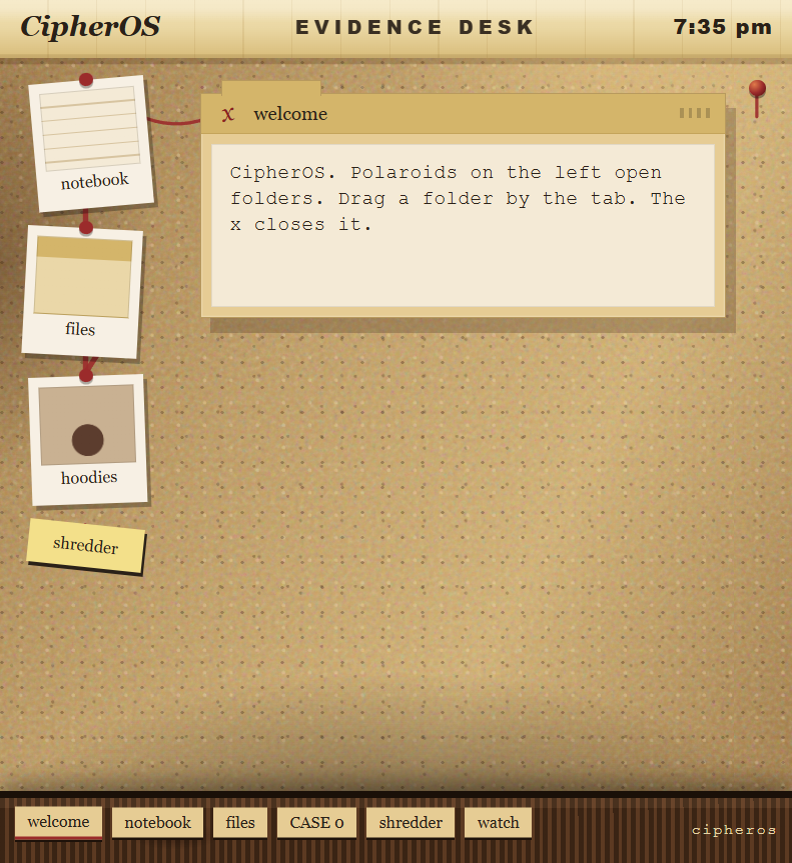
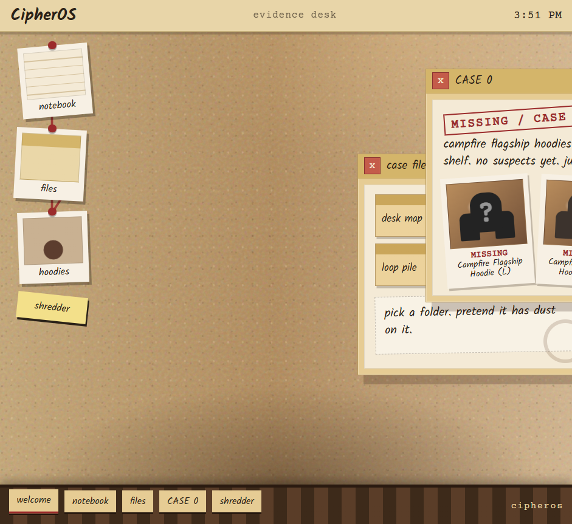

# CipherOS

A detective corkboard that runs in a browser tab. HTML, CSS and JavaScript. No frameworks, no build, no npm. Open `index.html` and it runs.

https://cipheros.techxtreme.me

(if that domain is down: https://cipheros-ten.vercel.app)



```
index.html   the page
style.css    cork, folders, polaroids
os.js        drag, close, pins, clock
apps.js      notebook, files, CASE 0, shredder
store.js     loads os.js then apps.js
shots/       screenshots for this readme
```

## Running it

Double-click `index.html`, or serve the folder so everything actually loads:

```
git clone https://github.com/its-techxtreme/cipheros.git
cd cipheros
python -m http.server 8000
```

Then open http://127.0.0.1:8000

## What's in it

**The board** is the whole page. Cork wall, tape bar with a clock, polaroids on the left, wood strip at the bottom. No wallpaper of a phone on a desk.

**Windows** are manila folders. Drag the tab (the grip on the right). The scribbly x closes them. Click a folder to bring it forward. No min, no max, no resize.

**notebook** takes clues. Pin note. They stick in this browser after refresh (`cipheros-notes` in localStorage).

**files** is a shelf of cards: desk map, active case, loop pile, CASE 0.

**hoodies** is CASE 0. Campfire Flagship Hoodies went missing (L, M, S). No shop photos, so they're silhouettes with a ? on them.

**shredder** says evidence destroyed: 0. It's empty on purpose rn.



No password. Polaroids open the folders. Don't lose the pins.

MIT, see LICENSE.
